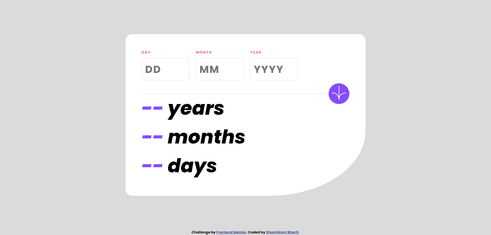

# Frontend Mentor - Age calculator app solution

This is a solution to the [Age calculator app challenge on Frontend Mentor](https://www.frontendmentor.io/challenges/age-calculator-app-dF9DFFpj-Q). Frontend Mentor challenges help you improve your coding skills by building realistic projects.

## Table of contents

- [Overview](#overview)
  - [The challenge](#the-challenge)
  - [Screenshot](#screenshot)
  - [Links](#links)
- [My process](#my-process)
  - [Built with](#built-with)
  - [What I learned](#what-i-learned)
  - [Continued development](#continued-development)
  - [Useful resources](#useful-resources)
- [Author](#author)
- [Acknowledgments](#acknowledgments)

## Overview

### The challenge

Users should be able to:

- View an age in years, months, and days after submitting a valid date through the form
- Receive validation errors if:
  - Any field is empty when the form is submitted
  - The day number is not between 1-31
  - The month number is not between 1-12
  - The year is in the future
  - The date is invalid e.g. 31/04/1991 (there are 30 days in April)
- View the optimal layout for the interface depending on their device's screen size
- See hover and focus states for all interactive elements on the page
- **Bonus**: See the age numbers animate to their final number when the form is submitted

### Screenshot



### Links

- Solution URL: [Age Calculator Code](https://github.com/kyubi2017/frontend-mentor-Age-calculator-app)
- Live Site URL: [Age Calculator](https://frontend-mentor-age-calculator-app-ha7o.vercel.app/)

## My process

- First of all, built html skeleton.
- Then added css to give a beautiful shape.
- At last functionality is added using js.

### Built with

- Semantic HTML5 markup
- CSS custom properties
- Flex box
- Mobile-first workflow

### What I learned

- Access the HTML elements in JavaScript
- Get Value from input tag
- Set inner text
- blur event and click event
- Calculating the age

```js
function validYear(y, m, d) {
  const secondDate = new Date();
  const firstDate = new Date(`${y}-${m}-${d}`);
  if (firstDate.setHours(0, 0, 0, 0) <= secondDate.setHours(0, 0, 0, 0)) {
    return true;
  }
  return false;
}
```

### Continued development

In future projects I would like to precise and optimize code so that minimum possible code should be there in project.

### Useful resources

- [Example resource 1](https://dev.to) - For getting year in past

## Author

- Website - [Oussama ait-ikhlef](https://portfolio-mu-blush-34.vercel.app/)
- Frontend Mentor - [@kyubi2017](https://www.frontendmentor.io/profile/kyubi2017)

## Acknowledgments

I am grateful for the opportunities you have given me to learn from your experience and expertise, and for the trust you have placed in me to take on new responsibilities and challenges. Your mentorship has been an inspiration to me, and I will always remember the valuable lessons and insights you have shared with me.
